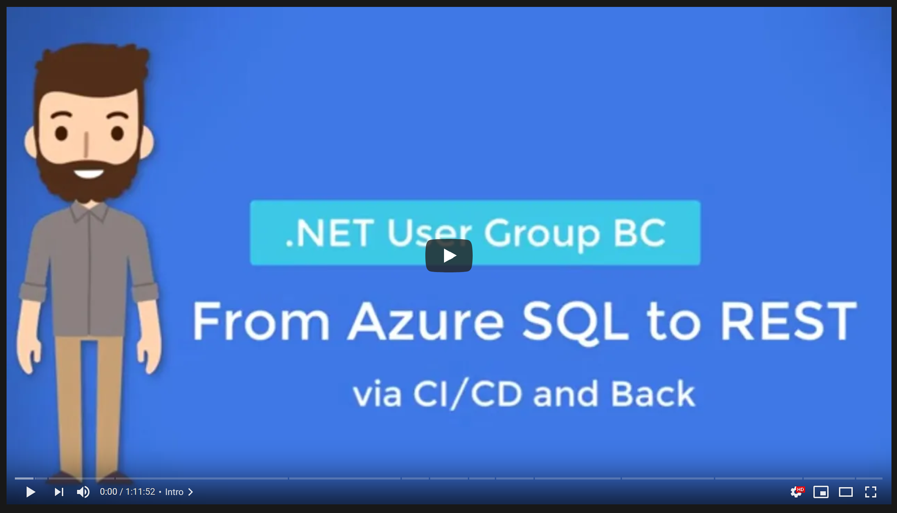

# BC .Net User Group Meeting - November 2020

Demo code used for the session 

**From Azure SQL to REST, via CI/CD and back**

How to create a REST API using Azure SQL, Dapper, .NET and JSON and live forever happily after. In this session we’ll start from a blank project and we’ll implement a fully working REST API, learning how to leverage the native support in JSON to easily and efficiently having .NET and Azure SQL working together with minimal effort but great performances. We’ll also see how to use Dapper to reduce the amount of code we need to write, all with a fully functioning CI/CD pipeline created using GitHub Actions.

## Notes

### A more refined example

This is a simplified version of the following repository:

https://github.com/Azure-Samples/azure-sql-db-todo-backend-dotnet

### Homeworks

This demo code, if tested using the Todo Backend API specs:

http://www.todobackend.com/specs/index.html

will result in errors for the tests related to the "order" property. This is done on purpose as an exercise you can make the small change needed in order to make it work. Have fun! :)

If you are looking for some inspiration, you can see how that can be done in three different way, depending on which degree of schema flexibility you want, here:

https://github.com/yorek/cloud-day-2020

### Slide Deck

Slide deck used in the session, with more details and links of the libraries and solution used in the session is here:

[From Azure SQL to REST, via CI/CD and back - Slide Deck](https://maurid-my.sharepoint.com/:p:/g/personal/info_davidemauri_it/ESr6ejdS5z9MvK2tsHa15RkB46MUkze0_S5rZr7I7Ny8VA?e=uJdPIM )

### Recording

Full recording of the session is available here:

- Intro ([0:00](https://www.youtube.com/watch?v=sWgUItG2beE&t=0s))
- Book - Practical Azure SQL for Modern Developers ([1:34](https://www.youtube.com/watch?v=sWgUItG2beE&t=94s))
- Session and Project description ([2:39](https://www.youtube.com/watch?v=sWgUItG2beE&t=159s))
- Creating REST API ([8:10](https://www.youtube.com/watch?v=sWgUItG2beE&t=490s))
- Azure SQL JSON Support ([22:45](https://www.youtube.com/watch?v=sWgUItG2beE&t=1365s)]
- Connect Azure SQL to REST API ([32:09](https://www.youtube.com/watch?v=sWgUItG2beE&t=1929s))
- Test GET Method ([34:25](https://www.youtube.com/watch?v=sWgUItG2beE&t=2065s))
- Dynamic Schema options ([37:35](https://www.youtube.com/watch?v=sWgUItG2beE&t=2255s))
- Running Todo Backend API test suite ([39:45](https://www.youtube.com/watch?v=sWgUItG2beE&t=2385s))
- Implementing Database Test with NUnit ([42:52](https://www.youtube.com/watch?v=sWgUItG2beE&t=2572s))
- Add Database Deployment via DBUp ([50:10](https://www.youtube.com/watch?v=sWgUItG2beE&t=3010s))
- Deploy solution using GitHub Actions ([57:54](https://www.youtube.com/watch?v=sWgUItG2beE&t=3474s))
- Demo of complete solution ([01:05:17](https://www.youtube.com/watch?v=sWgUItG2beE&t=3917s)) 
- Questions & Answers ([01:09:37](https://www.youtube.com/watch?v=sWgUItG2beE&t=4177s))

